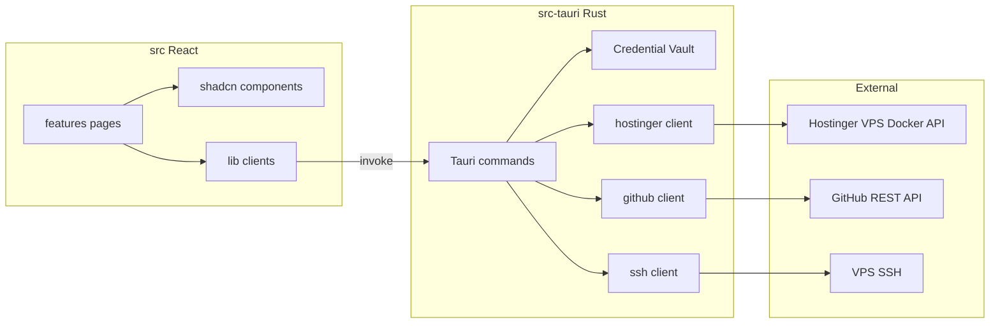
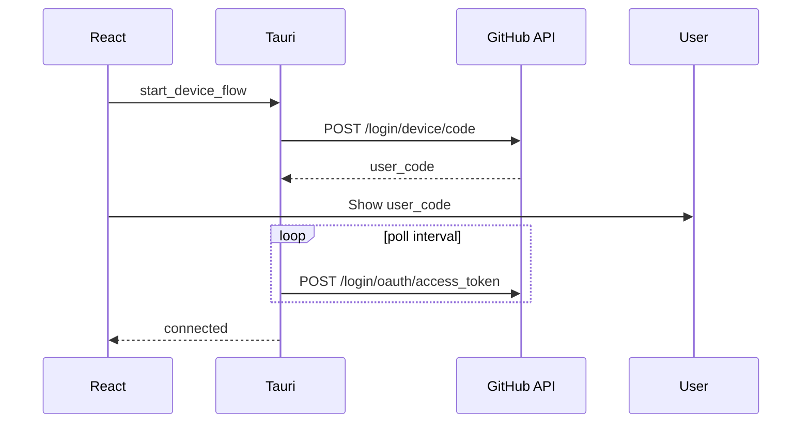

# Architecture

## Overview

HotDeploy is a Tauri 2 desktop application. The React frontend handles UI and user input. The Rust backend handles secrets, HTTP to cloud providers, and OS integration.



## Layer responsibilities

### React (`src/`)

- Routing, layout, forms, optimistic UI states
- TanStack Query for server state keyed by Tauri command results
- **Must not** store API keys or call Hostinger directly

### Rust (`src-tauri/`)

| Module | Role |
|---|---|
| `commands/credentials.rs` | Save/load/clear Credential Vault |
| `commands/hostinger.rs` | Tauri commands for VPS and Docker Project operations |
| `hostinger/client.rs` | HTTP client with Bearer auth |
| `hostinger/types.rs` | Serde types shared with commands |
| `hostinger/error.rs` | Structured errors → JSON for frontend |
| `github/client.rs` | GitHub REST (repos, secrets, Actions) |
| `github/oauth.rs` | Device flow authentication (Phase 8) |
| `ssh/client.rs` | Whitelisted SSH sessions (runner install) |

Phase 8 adds **device flow** for GitHub App auth (no client secret in bundle) and **workflow polling** for push-to-deploy instead of a local webhook server.



### api-harness (`packages/api-harness/`)

- Zod schemas mirroring Hostinger response shapes
- `FakeHostingerClient` with `callLog` for contract tests
- Used by Vitest; not bundled in production desktop app

## Provider adapter (future)

Phase 6 introduces `Provider` trait in Rust:

```rust
trait VpsProvider {
    fn list_vms(&self) -> ...;
    fn list_projects(&self, vm_id: u64) -> ...;
    // ...
}
```

`HostingerProvider` implements v1. React continues to call domain-shaped Tauri commands — not provider-specific endpoints.

## Security model

1. API key written only via `save_credentials` → OS keychain
2. `get_credentials_status` returns boolean + VM id, never the key
3. All outbound HTTPS from Rust with rustls
4. CSP configured in `tauri.conf.json` (tighten before production release)

## Build pipeline

| Stage | Tool |
|---|---|
| Frontend bundle | Vite → `dist/` |
| Desktop bundle | `tauri build` → platform installers |
| CI | GitHub Actions — lint, test, optional Tauri build matrix |

## Key files

| File | Purpose |
|---|---|
| `src-tauri/tauri.conf.json` | Window size, bundle id, icons |
| `src/lib/hostinger/client.ts` | Typed `invoke` wrappers |
| `vite.config.ts` | Alias `@/`, Vitest config |
| `pnpm-workspace.yaml` | Monorepo packages |

## Related docs

- [CONTEXT.md](../CONTEXT.md) — domain language
- [docs/RUNBOOK.md](RUNBOOK.md) — local dev and release
- [docs/CONVENTIONS.md](CONVENTIONS.md) — code style
